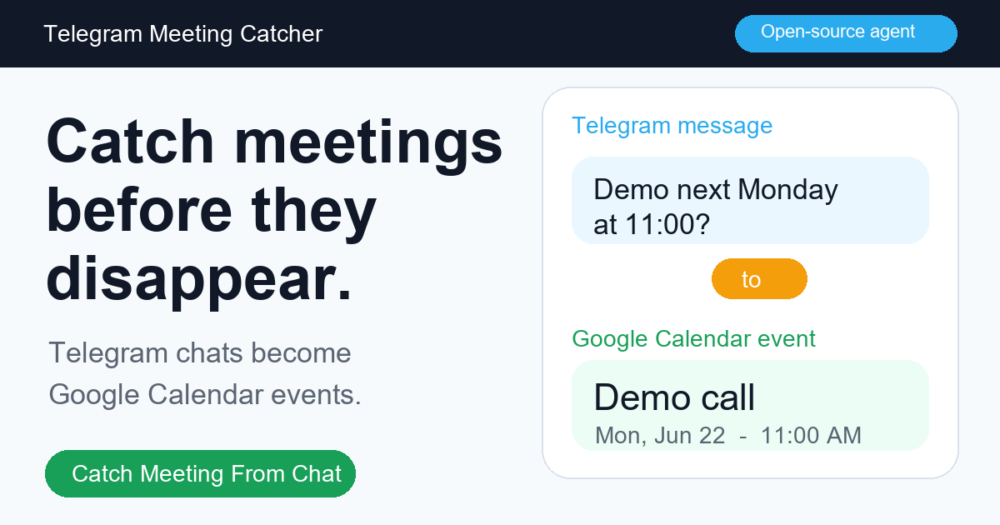
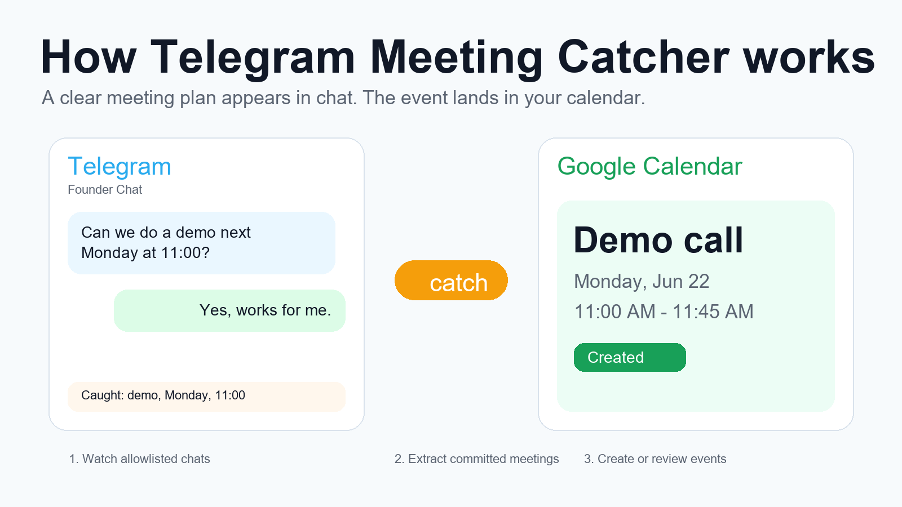

# Telegram Meeting Catcher

[](https://github.com/ainishanov/telegram-meeting-catcher/actions/workflows/ci.yml)



**Never miss a meeting buried in Telegram.**

Private Telegram meetings become calendar events.

Telegram Meeting Catcher watches selected Telegram chats and turns clear meeting
plans into Google Calendar events. You keep chatting as usual. The calendar
fills itself.



## Why It Exists

Important meeting plans get buried in Telegram. This catches them before you
forget.

## How It Works

1. Watch only the Telegram chats you allow.
2. Catch committed meeting plans with a date and time.
3. Create confident Google Calendar events or send uncertain ones to review.

## What It Does

- Watches only allowed Telegram chats.
- Extracts meetings, calls, demos, and appointments.
- Creates confident events in Google Calendar.
- Sends uncertain events to local review state.
- Dedupes by Telegram source message.
- Runs deterministic parsing before optional AI fallback.

## Why This Is Different

- Not a shared hosted listener for your private Telegram account.
- Not a bot that needs to be invited into every chat.
- Not a calendar assistant that reads everything by default.
- Self-hosted first, with dry-run before any calendar write.

## Example

Input message:

```text
Can we do a demo next Monday at 11:00?
```

Dry-run output:

```json
{
  "summary": "Demo call",
  "startDate": "2026-06-22",
  "startTime": "11:00",
  "durationMinutes": 45,
  "extractor": "deterministic"
}
```

## Try Without Credentials

```bash
npm install
npm run demo
```

## Self-Hosted Setup

```bash
cp .env.example .env
npm run setup:telegram
npm run setup:google
npm run doctor
npm run scan -- --limit 50
npm run listen -- --dry-run
```

Set `TMC_TIMEZONE` to your local IANA timezone before creating real calendar
events, for example `America/New_York` or `Europe/London`.

Only remove `--dry-run` after the caught events look right.

## Docker Personal Instance

```bash
cp .env.example .env
npm run setup:telegram
npm run setup:google
docker compose up --build
```

The Docker command starts in dry-run mode. Remove `--dry-run` from
`docker-compose.yml` only after `npm run scan -- --limit 50` catches the right
events.

## Deploy

Run it as a private personal worker on a VPS or cloud platform that supports
Docker.

See [docs/DEPLOY.md](docs/DEPLOY.md).

## Review Flow

Uncertain events are held for review instead of being created automatically.

```bash
npm run review
npm run confirm -- <review-id>
npm run skip -- <review-id>
```

## Product Promise

Less copying. Fewer missed calls. One calendar that stays current.

## Built For

- founders who schedule in Telegram;
- sales teams with Telegram-heavy leads;
- consultants and agencies;
- recruiters and operators;
- anyone who keeps forgetting chat-based meeting plans.

## Safety First

This repo is built for self-hosted use. Do not connect a full Telegram account
to a hosted service you do not trust.

Start with:

- whitelisted chats only;
- dry-run mode;
- confirmation-first settings;
- local state;
- no channel listening.

See [docs/PRIVACY.md](docs/PRIVACY.md).

## Setup Guides

- [Telegram session setup](docs/SESSION_SETUP.md)
- [Runbook](docs/RUNBOOK.md)
- [Deploy guide](docs/DEPLOY.md)
- [Personal cloud architecture](docs/PERSONAL_CLOUD.md)
- [Launch plan](docs/LAUNCH_PLAN.md)
- [Launch posts](docs/LAUNCH_POSTS.md)
- [Roadmap](docs/ROADMAP.md)
- [Security policy](SECURITY.md)

## Environment

```bash
cp .env.example .env
```

Required for real Telegram listening:

- `TG_API_ID`
- `TG_API_HASH`
- `TG_SESSION_STRING`
- `TMC_ALLOWED_CHATS`

Required for calendar creation:

- `GOOGLE_CLIENT_ID`
- `GOOGLE_CLIENT_SECRET`
- `GOOGLE_REFRESH_TOKEN`

Optional AI fallback:

- `OPENAI_API_KEY`
- `OPENAI_BASE_URL`
- `OPENAI_MODEL`

## Public Page Copy

Headline: **Never miss a meeting buried in Telegram.**

Core description: **Telegram meetings become calendar events.**

CTA: **Catch Meeting From Chat**

Social preview: [assets/og-image.png](assets/og-image.png)

Search phrase: `Telegram to Google Calendar, self-hosted Telegram meeting automation`.

## Status

Public v0.1.0. The core extraction and calendar adapter are intentionally small
so the trust boundary is easy to audit.

## License

MIT
